# Wooden Corne Keyboard Case

I wanted to give my corne keyboard a nice looking case because I don't like these 3D printed plastic cases. And since I am a woodworker as well I got the idea to build one from wood.

Here is the result.

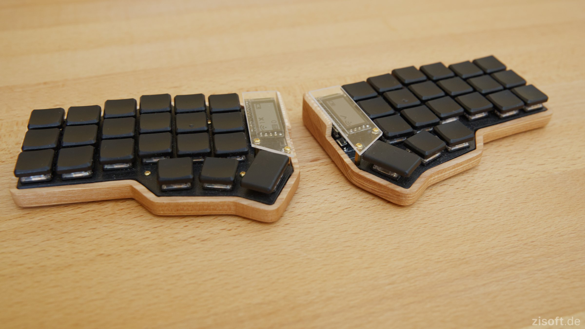

## What you need
Besides some basic woodworking skills you need some tools:

- router
- 17mm copying ring
- 4mm router bit
- Sanding paper: 180 and 240 grid
- Double-sided tape

To build the router templates:

- 8mm plywood
- fretsaw

And of course a piece of some nice looking wood. I have used ash for my case. The piece needs to be of 8mm thickness.

## Building the router templates
Print out the `corne_kbd_router_template.pdf`, make sure to print at 100% scale.
Glue that print on a piece of 8mm plywood. Use a fretsaw to carefully saw out the outer and the inner template (use the solid lines). Smooth the edges with some sanding paper, carefully keep the dimensions. Drill some holes for mounting the templates on the wood. The templates should now look like this:

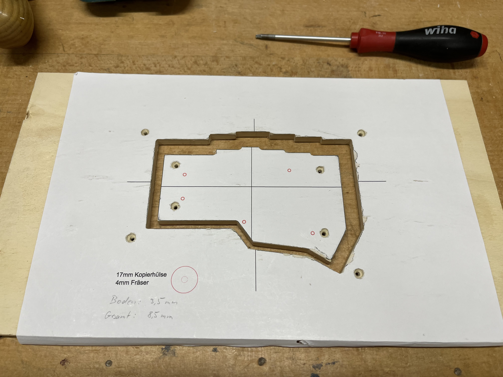

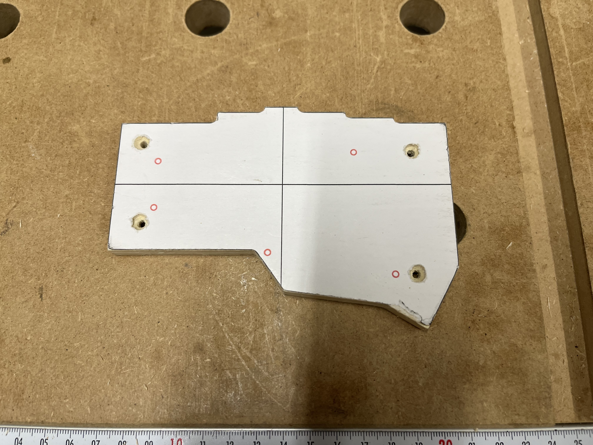
Template for the outer contour

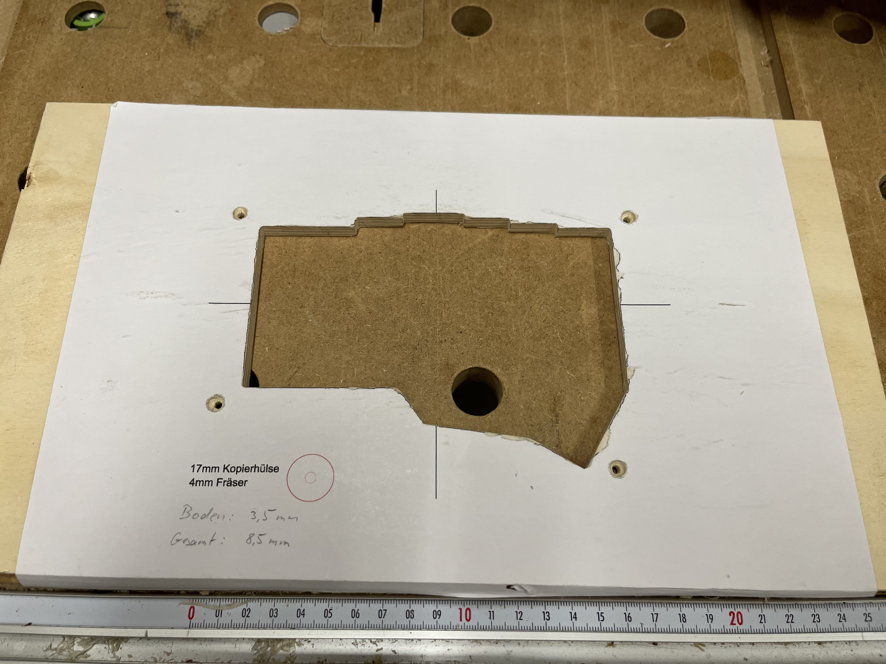
Template for the inner contour

## Routing the cases
Mount the wood blank with double-sided tape on a piece of scrapwood. This is required to protect your workbench because the outer contour needs to be cut all the way through the wood. Make sure the tape covers enough area. After routing the outer contour both pieces must still be fixed in their positions on the scrap wood!

Screw the template for the outer contour on the wood. It is important to use short screws here, they must not stick out through the bottom of the blank! Don't worry about the screw holes, they will be removed later when we route out the inner contour.

Mount the 17mm copying ring on the router as as well as the 4mm router bit. Then carefully follow the outer contour of the template. Use several passes, increase the cutting depth slightly between them.

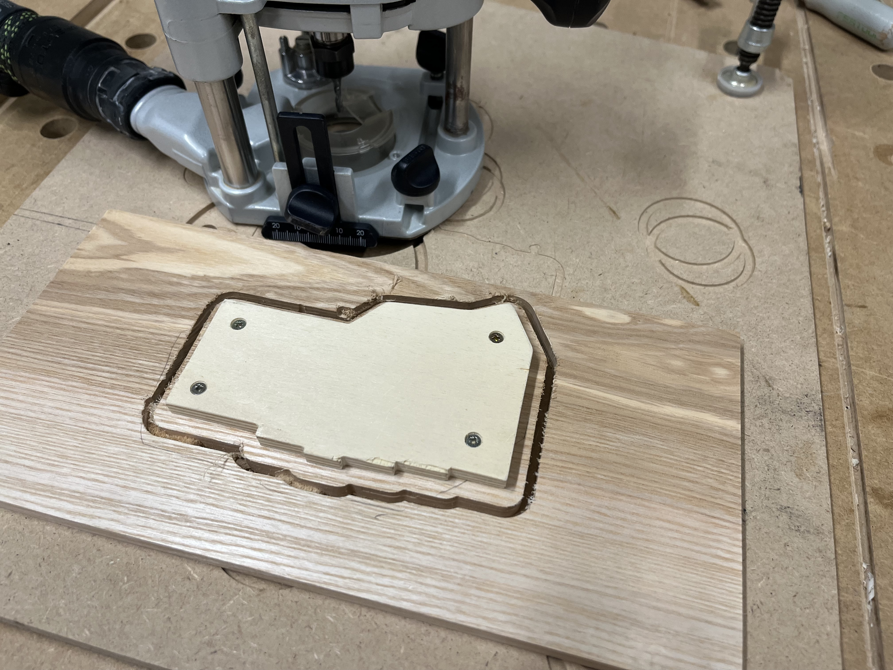
Routing the outer contour

Don't unscrew the template! We first need to carefully position the big template for the inner contour. It needs to have an equal distance of 9mm to all edges of the small template. This is easiest to be done by using the shaft of an 9mm drill bit. Place the big template on the wood blank and align it by holding the drill bit shaft between the two templates. If all fits well, screw the template on the blank. You can now unscrew the small template.

Set the depth stop of your router so that there will be 3mm thickness left for the bottom. Carefully route out the inner contour by removing all the material.

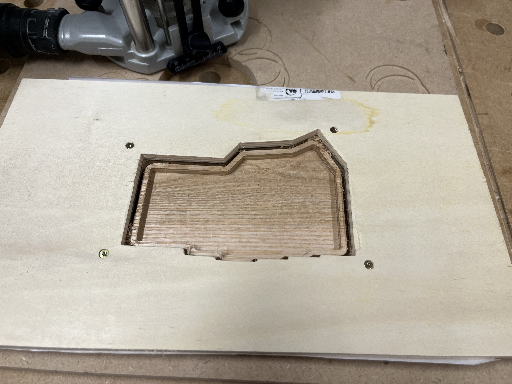
Routing the inner contour

The first case is now ready, carefully remove it from the scrap wood.

Now flip the templates upside down and repeat all the steps for the second case.

Use the printed circuit of your corne keyboard to mark the positions of the five mounting holes and use a 2mm bit to drill them.

Use the sanding paper to smooth all surfaces. Apply a finish of your liking to protect the wood. I have used bees wax.

Stick some rubber feets, mount the keyboards and you are done!

# Images

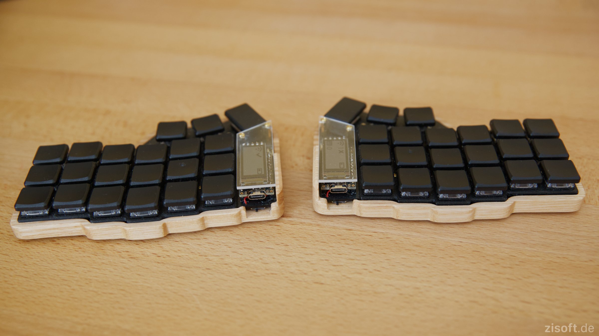
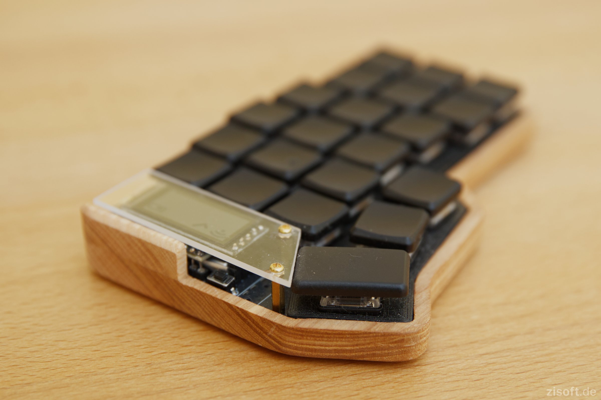
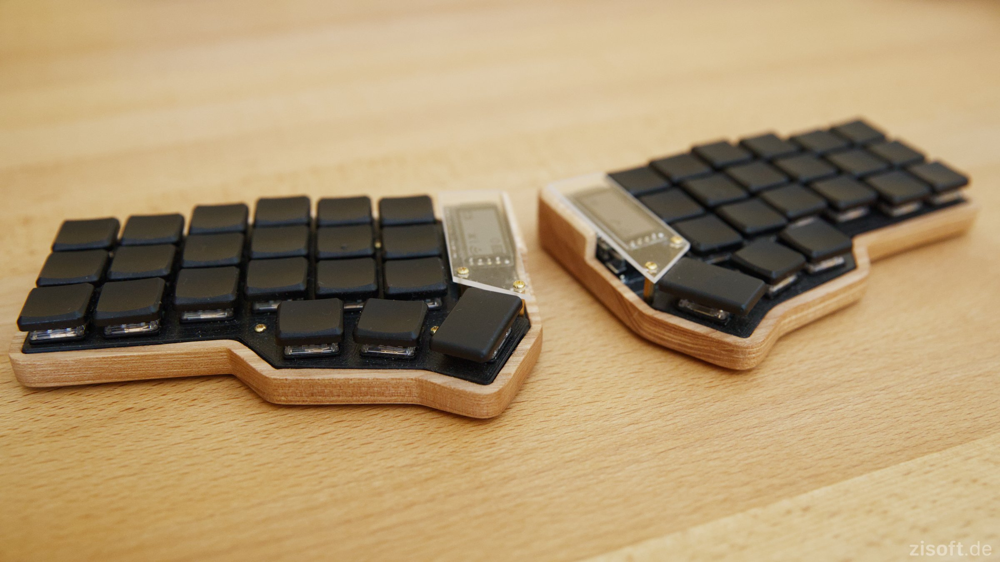
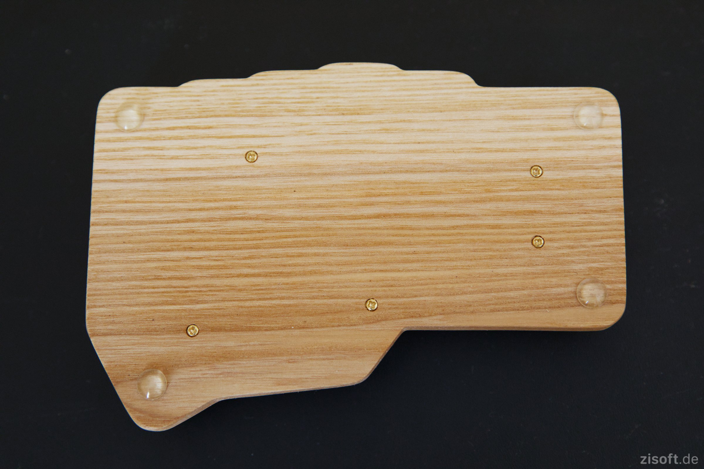
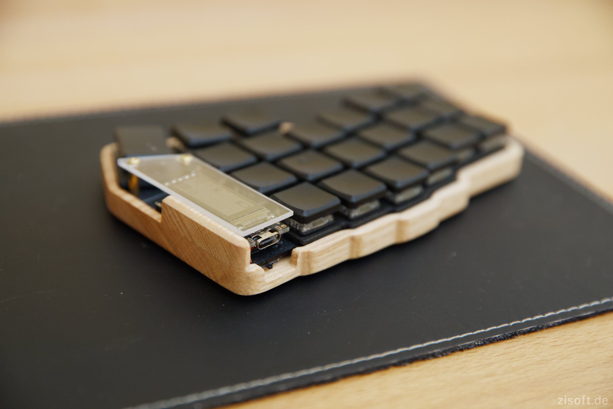
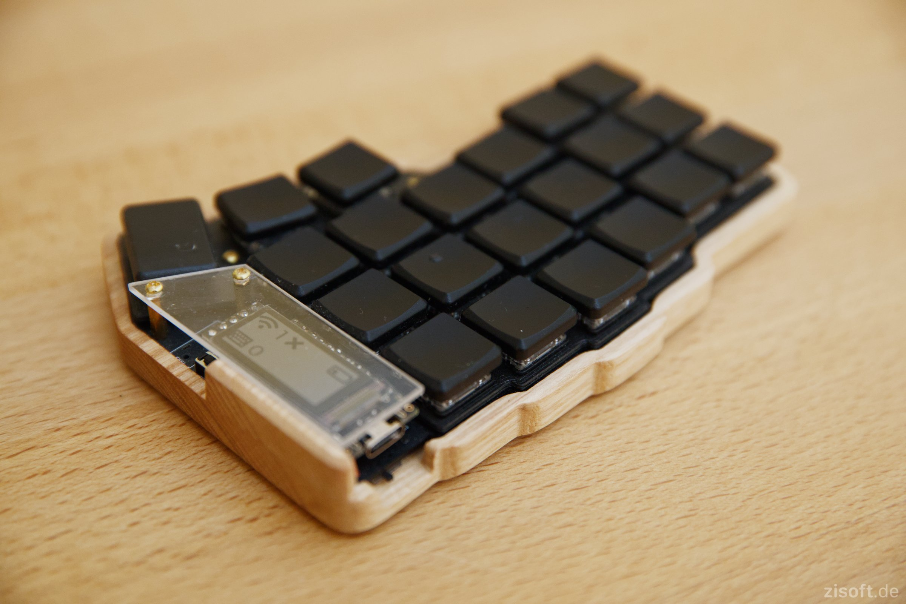
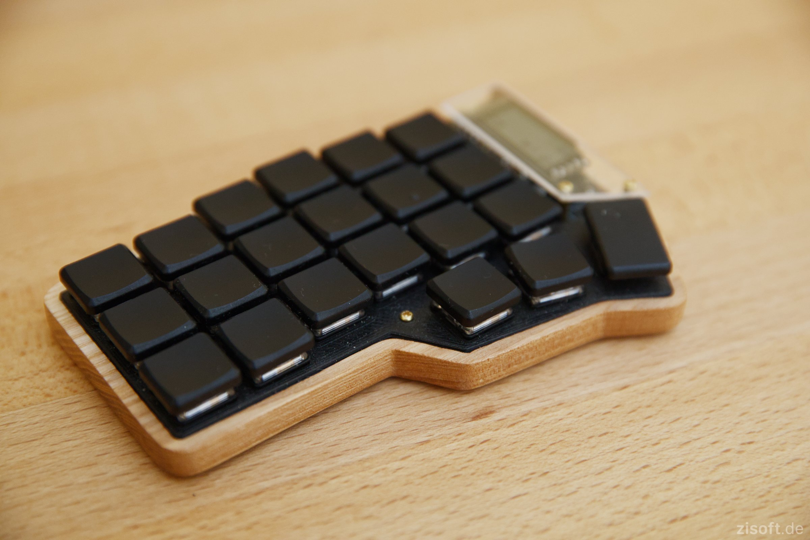
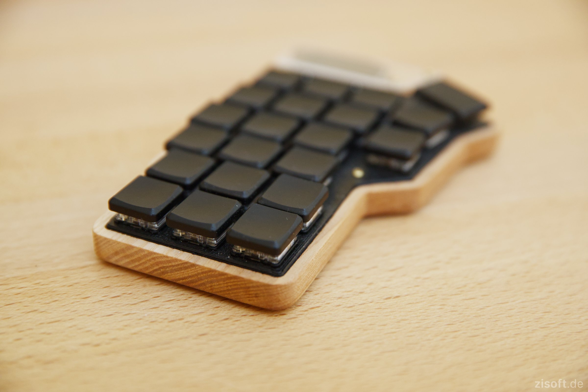
